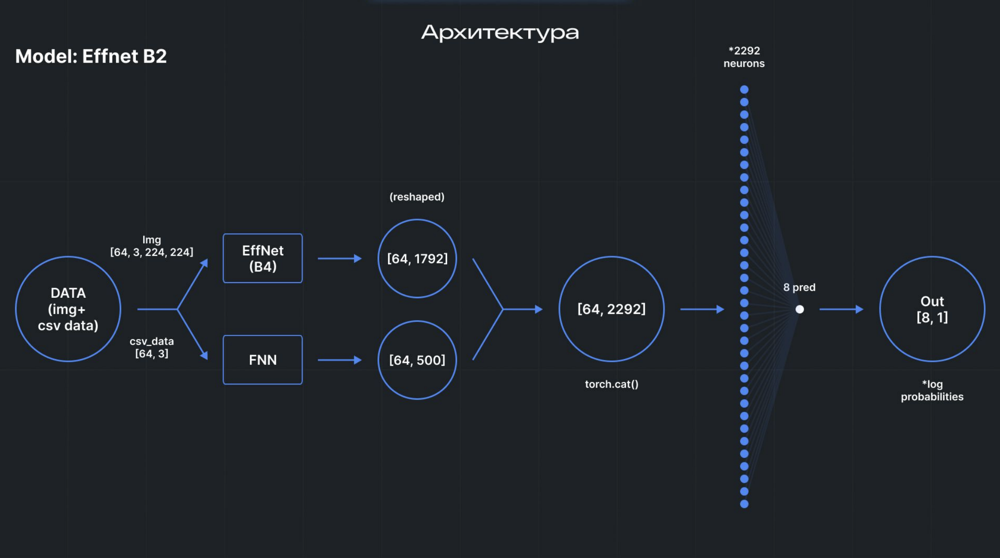
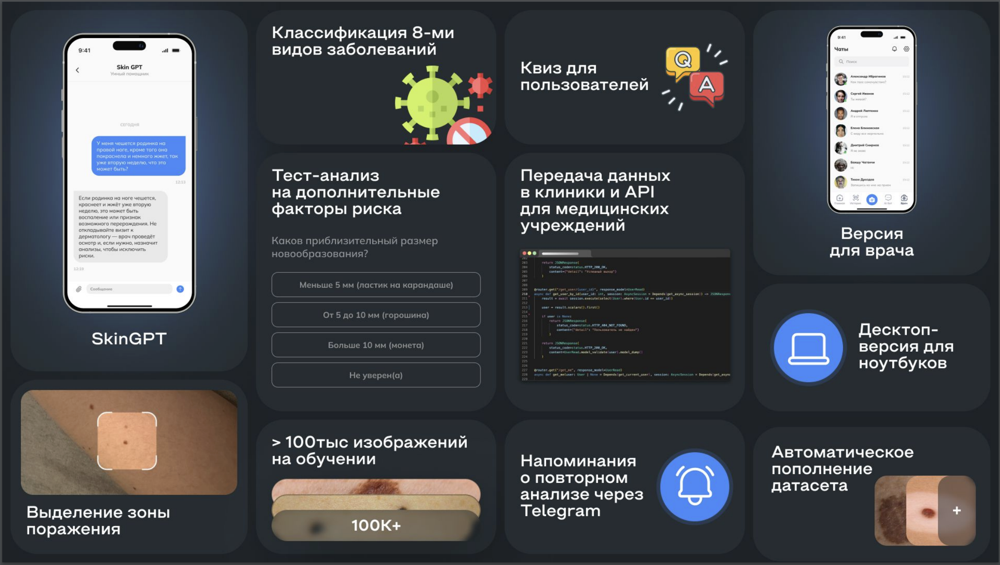

# **Проект: Сервис для Раннего Выявления Рака Кожи**

## **Описание**
Этот проект представляет собой полностью функционирующий сервис для раннего выявления рака кожи. Он предназначен для пациентов, врачей-дерматологов и медицинских учреждений. Система использует искусственный интеллект для анализа изображений кожи, определения новообразований и оценки их риска, а также предоставляет рекомендации пользователю.

Проект был создан в рамках **Сеченовского Хакатона** и владельцем данного кейса является компания **Третье Мнение**.

## **Команда**
1. **Колокольцев Ярослав** (UX/UI Дизайнер): Разрабатывал концепцию пользовательского интерфейса и опыта взаимодействия с сервисом. [Telegram](https://t.me/whatthebooff)
2. **Осокин Ярослав** (Frontend-разработчик): Разрабатывал фронтенд веб-приложения, использовал Vue.js и Pinia для управления состоянием. [Telegram](https://t.me/osyarik)
3. **Уросов Дмитрий** (ML-специалист): Обеспечивал разработку и интеграцию моделей машинного обучения для анализа изображений и сегментации новообразований. [Telegram](https://t.me/dmmmit)
4. **Адзиев Хизри** (Backend-разработчик): Писал API для проекта, создавал базу данных, настраивал Docker файлы и Docker Compose файлы. [Telegram](https://t.me/zhinkinzver)
5. **Смирнов Павел** (ML-специалист): Обеспечивал обучение и настройку моделей для анализа изображений и сегментаций. [Telegram](https://t.me/pa8lusha) 
6. **Каримов Айдар** (ML-специалист): Работал над развитием архитектуры и интеграцией сервиса, дообучал vision transformer для классификации типа рака кожи, добавил медицинского чат-бота для консультации по заболеваниям. [Telegram](https://t.me/aidarkarimovvw)

## **Технологии**
- **ML**: PyTorch, scikit-learn, Llama3.2 11b
- **BACKEND**: FastAPI, Redis, PostgreSQL, SQLAlchemy, Docker
- **Frontend**: Vue.js / PINIA
- **OpenAI**

## **Ключевые Функции**
1. **Распознавание объектов на фото**: Проверка изображений для определения новообразований.
2. **Удаление волос и цветокоррекция**: Обработка изображения для улучшения качества анализа.
3. **Мультимодальная нейросеть**: Обработка изображений с использованием сверточных и линейных слоев, обученных на медицинских данных.
4. **Оценка риска и объяснение результата**: Выдача оценки риска и объяснение причин оценки, основанное на принципах ABCDE.
5. **История анализа**: Сохранение и отслеживание истории анализов с возможностью мониторинга изменений.
6. **Консультации с врачом**: Отправка отчета о кожном заболевании лечащему врачу и возможность задавать дополнительные вопросы.
7. **Автоматическое пополнение датасета**: Добавление пользовательских фотографий в базу данных для улучшения модели.
8. **Интерактивный квиз**: Интерактивный контент для пользователей, помогающий узнать больше о признаках опасных новообразований.

## **Архитектура и Структура Проекта**

- Сервис использует микроархитектуру с несколькими компонентами, включая нейронную сеть для анализа изображений, веб-интерфейс, и базы данных для хранения истории анализов.
- Доступ к сервису возможен через веб-интерфейс и десктоп-версию для удобства использования в медицинских учреждениях.

## **Демонстрация**


## **Как Запустить**

1. **Клонировать репозиторий:**
   ```bash
   git clone https://github.com/qqdzv/Sechen-Hack.git
   ```

2. **Создать файл `.env` и заполнить его с примерными значениями:**
   ```plaintext
   DB_HOST=
   DB_PORT=
   DB_NAME=
   DB_USER=
   DB_PASS=

   REDIS_HOST=
   REDIS_PORT=

   TG_ID_ADMIN=
   TGBOT_TOKEN_ADMIN=
   NOTIFICATIONS_TGBOT_TOKEN=

   SECRET_JWT=
   JWT_ALGORITHM=HS256
   ACCESS_TOKEN_EXPIRE_MINUTES=

   CHAT_BOT_API=
   ```

3. **Запустить проект:**
   ```bash
   docker compose up --build -d
   ```
## **Демонстрация работы**
   [Гугл диск](https://drive.google.com/file/d/13BOtTEDqvKlqxQ2qkyg5bJxjdEVAX_7y/view?usp=drive_link) (Доступ есть только у учетных записей НИТУ МИСИС)

### **Заключение**

Этот проект важен, так как он решает актуальную проблему раннего выявления рака кожи, предоставляя точную и быструю диагностику новообразований. В отличие от аналогов, сервис использует мульти-модальные нейронные сети для анализа изображений и текстовой информации, что повышает точность диагностики. Планы по развитию включают расширение функционала, добавление новых анализов и интеграцию с медицинскими учреждениями для улучшения алгоритмов на основе новых данных.

## **Лицензия**
- Лицензия: MIT License


